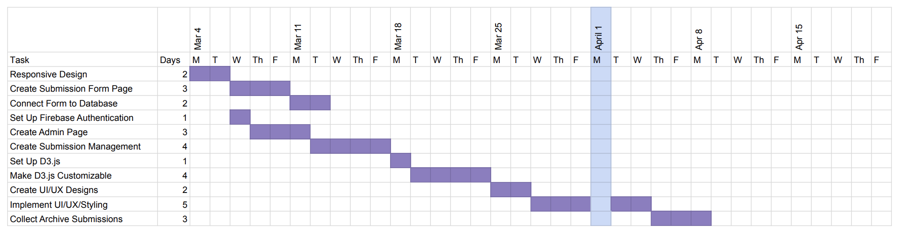

# 4.1 Software Development Plan

## 4.1 Plan Introduction

This Software Development Plan provides the details of the planned development for The Living Archive, a web application that serves as an interactive archive for queer histories at Loyola Marymount University.

With this web app, users will be able to view and search the archive, view data visualizations of the archive content, submit their own archival records, and if they are an approved administrator, manage submissions. Developing these features will require integrating a data visualization API, creating a submission form connected to the existing archive database, and setting up an authentication log-in process. The web app archive is currently supported through Google Firebase, so all these new features will be integrated into the existing databases.

Deliverable Schedule

| Deliverable        | Deadline |
| ------------------ | -------- |
| Responsive Design  | Week 9   |
| Submission Form    | Week 10  |
| Admin Portal       | Week 11  |
| Data Visualization | Week 11  |
| Styling            | Week 13  |

## 4.2 Project Resources

This section details the various hardware and software resources necessary for developing this project.

### 4.2.1 Hardware Resources

Development Machine

- Device: Apple MacBook Pro
- Operating System: macOS Ventura 13.0
- Processor: 1.4 GHz Quad-Core Intel Core i5
- RAM: 16 GB

Mobile Testing Device

- Device: Apple iPhone 13
- Operating System: iOS 16.7
- Chip: A15 Bionic
- RAM: 4 GB

### 4.2.2 Software Resources

Development Environment

- Deployment: Vercel
- Testing Browser (Web): Chrome
- Testing Browser (Mobile): Safari
- Text Editor: Visual Studio Code v1.86.2

Development Tools

- Backend/Scripting: Node.js v.18.17.0
- Framework: React.js v18.2.0
- Styling: Tailwind CSS v3.3.3

Third-Party Libraries

- Axios v1.6.2
- D3.js
- Google FIrebase Authentication
- Google Firebase Cloud Storage
- Google Firebase Firestore
- Google Maps Geocoding API
- Google Maps JavaScript API

Design Tools

- User Interface Design: Figma

## 4.3 Project Organization

This section outlines the major functions and their primary tasks for The Living Archive.

### 4.3.1 Frontend

Frontend development will consist of creating the interfaces and functionality for the web app. The primary tasks include using React to create the submission and administrator pages, integrate user interaction into the data visualization charts, and make the app responsive on both web and mobile platforms.

### 4.3.2 Backend

Backend development will consist of managing the databases, designing authentication protocol, and integrating the data visualization API. Because the main archive database is already functional, the primary responsibility will be incorporating edit and delete functionality into the database.

### 4.3.3 Research

Loyola Marymount University’s Archives and Special Collections department will be consulted for this project to ensure correct permissions are requested when collecting user submissions. University archives will also be gathered from the Archives digital collections to be displayed on the web app.

## 4.4 Schedule

This section provides schedule information for The Living Archive.

### 4.4.1 GANTT Chart

### 4.4.2 Task and Resource Table

| Task                           | Resources               |
| ------------------------------ | ----------------------- |
| Create Submission Form Page    | React                   |
| Connect Form to Database       | Firebase                |
| Set Up Firebase Authentication | Firebase                |
| Create Admin Page              | React                   |
| Create Submission Management   | React, Firebase         |
| Set Up D3.js                   | D3.js                   |
| Make D3.js Customizable        | D3.js                   |
| Create UI/UX Designs           | Figma                   |
| Implement UI/UX and Styling    | Tailwind                |
| Collect Archive Submissions    | LMU Community, Archives |
