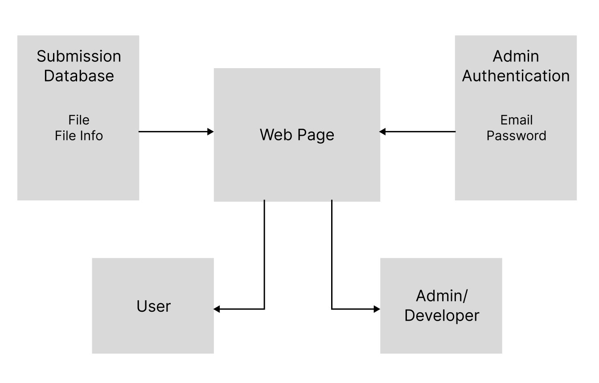

# 5.0 Requirements Document

## 5.1 Introduction

### 5.1.1 Description

This Software Requirements Specification documents the requirements for the interactive web-app archive, called The Living Archive. This web app is a continuation of last semester’s work and currently consists of an image gallery and a campus map. This document will provide information on the planned additions: an archive record submission page, an administrator login/approval portal, and an interactive data visualization chart. Development of this project will continue in React.js and Node.

### 5.1.2 Diagram

### 5.1.3 Document Overview

This document is organized as follows. Section 5.2 describes the expected functional features of the project. Section 5.3 describes the required performance and outcomes of the web page and its resources. Section 5.4 lists the necessary software and hardware to develop and use the site.

## 5.2 Functional Requirements

The Living Archive will be gaining three new features. First, the Archival Record Submission page will allow any users to submit to the archive. Next, the administrator page will let developers approve submissions. Lastly, the Archive Data Visualization will let all users interact with the archive. The submission and administrator page can be accessed through buttons on the web app navigation bar, and the data visualization component will be displayed on the main page after the existing features.

### 5.2.1 Archival Record Submission Page

5.2.1.1 The page shall be displayed within the main web app.

5.2.1.2 The page shall include prompts for users to submit their information.

5.2.1.3 The page shall include, but will not be limited to, the following prompts:

- File
- Title
- Description
- Date
- Creator/Author
- Location
- Contributor Name
- Email
- Confirm Email
- Opt-In to Display Contributor Name

5.2.1.4 The Files prompt shall have an upload button.

The upload box will allow the user to single click the button, which will open the user’s system file chooser dialog.

The file chooser will allow the user to upload one file to the form.
The upload box will allow the user to drag and drop one file into the upload box.

5.2.1.5 The Opt-In to Display Contributor Name prompt shall have a checkbox.

5.2.1.6 The remainder of prompts from requirement 5.2.1.2 shall be input boxes.

5.2.1.7 The page shall display an error message if the user does not submit the required information.

5.2.1.8 The required prompts include, but are not limited to:

- Files
- Contributor Name
- Email
- Confirm Email

5.2.1.8 The page shall display an error message if the user does not enter the same email in both email prompts.

### 5.2.2 Administrator Page

5.2.2.1 The page shall require the user to log in with an email and password.

5.2.2.2 The page shall allow the administrative user to view unapproved submission records in a grid format.

5.2.2.3 The page shall have a “Filter” input box.

The filter box shall accept keywords and dates.

5.2.2.4 The page shall have a “Sort By” box.

5.2.2.5 The records in the grid shall display the entire record submission when clicked.

The record shall display a larger and expandable version of the record photo.

The record shall include all the information the user provided.

The record shall have a button to either reject or approve the submission.

5.2.2.6 The page shall have a button to display previously rejected/approved applications

### 5.2.3 Archive Data Visualization

5.2.3.1 The Archive Data Visualization shall consist of a number of interactive charts to display the number of archive items according to the following categories:

- Student Organization
- Year/Date
- Location

5.2.3.2 The individual charts shall have buttons to customize the different choices within each category.

5.2.3.3 The Student Organization chart and Location chart will have a search input box.

The search input box will have an ‘Enter’ button beside it.

The word will display as a button beneath the box.

The user will be able to remove a word by clicking the ‘X’ on the word’s button.

5.2.3.4 The Year/Date box shall have a date input box.

The input box will have the same adding and deleting capability as the search input box.

## 5.3 Performance Requirements

### 5.3.1 Archival Record Submission Page Performance

5.3.1.1 The application shall receive the user’s form within 5 seconds of the user clicking the submit button.

### 5.3.2 Administrator Page Performance

5.3.2.1 The application shall verify the user’s email and password within 3 seconds of the user attempting to log in.

5.3.2.2 The application shall display submissions within 3 seconds after the user logs in.

5.3.2.3 The application shall update the Image Gallery within 20 seconds after the user approves a submission.

### 5.3.3 Data Visualization Performance

5.3.3.1 The chart shall update within 3 seconds of the user making a customization.

## 5.4 Environment Requirements

### 5.4.1 Development Environment Requirements

5.4.1.1 The application shall not require any special computing hardware for development.

5.4.1.2 The developer shall have the following software to develop the application: Google Firebase, D3.js, and Node v18.17.0 or above.

### 5.4.2 Execution Environment Requirements

5.4.2.1 The application shall be deployed via Vercel.

5.4.2.2 The application shall be accessed with any standard web browser.
