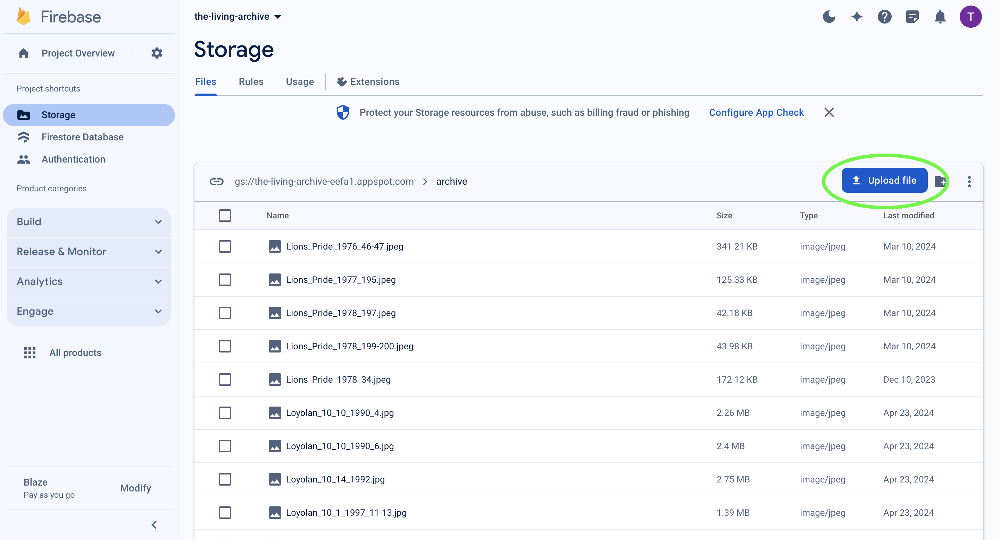

# Users Manual

This document is a guide to developing this web-app, navigating the Firebase schema, and understanding the general features of the site. There are tips on troubleshooting as well as my contact information to reach out with any questions/concerns.

## Install

In a terminal, navigate to your desired location for the codebase and clone the repo.

`git clone https://github.com/toriwei/the-living-archive.git`

Use `npm` to install dependencies.

`npm install`

This project requires a Node.js version of at least 18.17.0. Node Version Manager (`nvm`) can be used to switch Node versions.

`nvm use v18.17.0`

## Start

Start an instance of the site on `local:3000`.

`npm run dev`

## Stop

Stop the environment with the following shortcut:

`ctrl + c`

## Features

The Living Archive has 4 main features: Gallery, Map, Submit, and Admin. All of the React components for these features can be found in the `pages` folder. The `firebase` folder contains the configurations and back-end upload scripts for the databases. This project was developed in React with Node.js and Tailwind CSS and is hosted on Vercel. The Living Archive can be accessed live [here](https://the-living-archive.vercel.app/).

## Databases

Records can be uploaded either by developers through the Node command line tools or manually through the Firebase Console, or through the site's submission form (open to everyone).

### Developer/Back-end Uploads

The `firebase` folder has all files related to the Firebase databases as well as command-line tools to upload multiple image metadata records.

#### Firestore: Image Metadata

`firebaseUpload.js` can be run with the command `firebaseUpload [fileName]` if there is an existing JSON file with image metadata. The data file should be formatted as a JSON object. See `testData.json` for an example.

`Metadata-Template.xlsx` provides a template on how what attributes to include. It can be filled out, downloaded as a CSV an converted to JSON with a tool like [csvjson.com](https://csvjson.com/csv2json) and then converted to the necessary structure with the Node script `preprocessing`. Be sure to update the JSON file name within `preprocessing.js`.

#### Storage: Image Files

Image files must manually be uploaded to the Storage databse via Firebase Console.

### Site/Front-end Uploads

The Submit tab on the website can allow anyone to submit an image and its corresponding metadata to the archive. The Firebase Storage and Firestore databases have two collections: `archive` and `data` for the respective public image gallery items and `submission_archive` and `submission_data` for the items submitted through the form. If an approved user accepts the submission through the Admin portal, a copy of the respective files make a copy from `submission_[collection_name]` to `collection name`.

## Troubleshooting

For images/data that do not show in the archive, first verify that the titles of the corresponding image/data are the same (though the data will not have a file extension type). Ex: the file `Lions_Pride_1976_46-47.jpeg` in Storage's `archive` has its respective metadata within a document titled `Lions_Pride_1976_46-47` in Firestore the `data` collection.

The campus map utilizes a React wrapper of the Google Maps API and calls the Google Geocoding API via Axios. The Geocoding API converts string locations to coordinates for the Google Maps API which renders all other aspects of the map functionality.

## Further Contact

Contact `toriwei02@gmail.com`.
